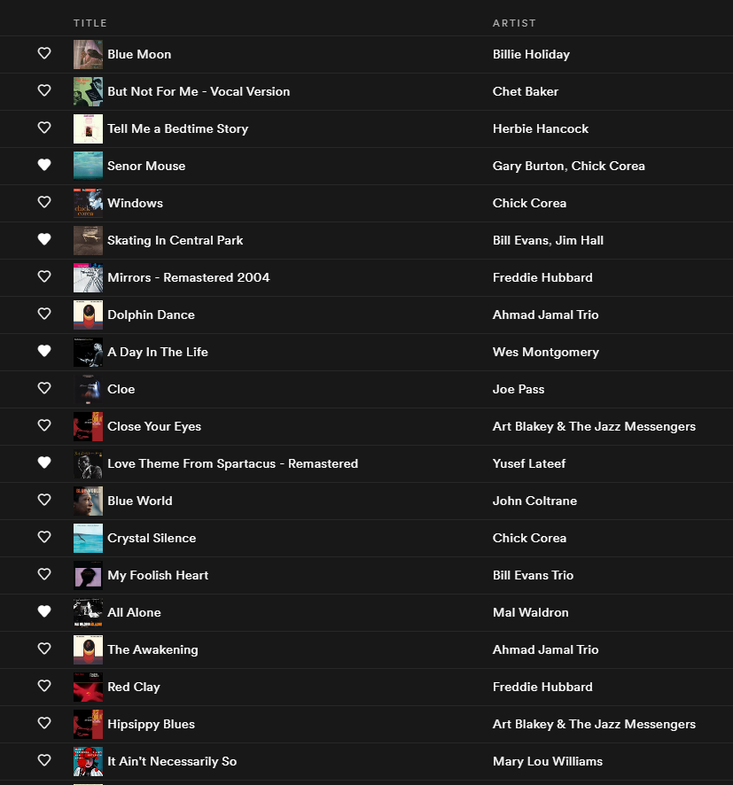
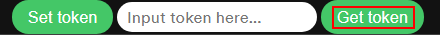
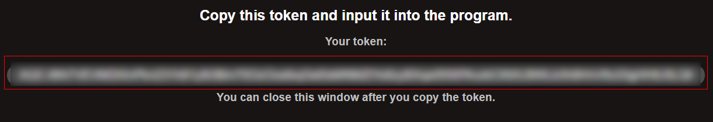
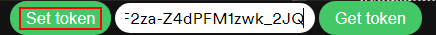
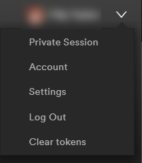

# Spotify Cover Art Injector

[](https://npmjs.org/package/spotify-cv-inject)
[](https://github.com/https://github.com/filiptrplan/spotify-cover-art/blob/master/package.json)

### Program for adding cover art into playlists on the Spotify desktop client.



## Installation and usage
**Prerequisites:**
 - [Node.js](https://nodejs.org/en/)
 - [NPM](https://www.npmjs.com/get-npm) - usually comes with Node.js
  

Simply run:
```
$ npm install -g spotify-cv-inject
```
### Launching
You can run the command in two ways:
```
$ spotify-cv [PATH_TO_SPOTIFY]
$ spotify-cv
```
If you specify the path, Spotify launches with all the appropriate flags. 

If you omit the path, you need to run the Spotify app with the following flag:
```
--remote-debugging-port=3131
```
You can add this flag to your shortcut or find another way to run it.

### Usage
1. Launch the program according to [Launching](###launching)
2. Click `Get Token` at the top of the Spotify app
   
   

3. After clicking `Authorize`, you will be redirected to the following page where you must copy the token you are provided with.



4. Paste the token into the input and click `Set Token`



5. The app should work as intended! If it doesn't, completely close the app(don't forget the system tray) and launch it according to [Launching](###launching).

## Troubleshooting
If you come across a problem there is little support I can provide because the method of retrieving isn't wholly reliable. I recommend clearing the tokens by clicking the dropdown next to your profile and restarting the app with: 
```
$ spotify-cv [PATH_TO_SPOTIFY]
```



If that doesn't work feel free to post it in the issues.